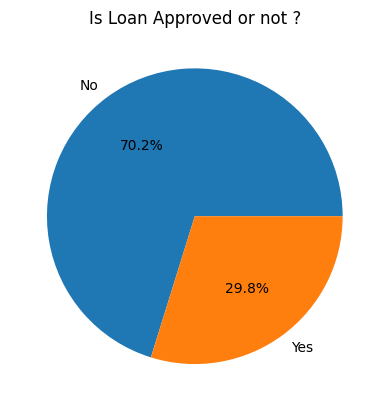
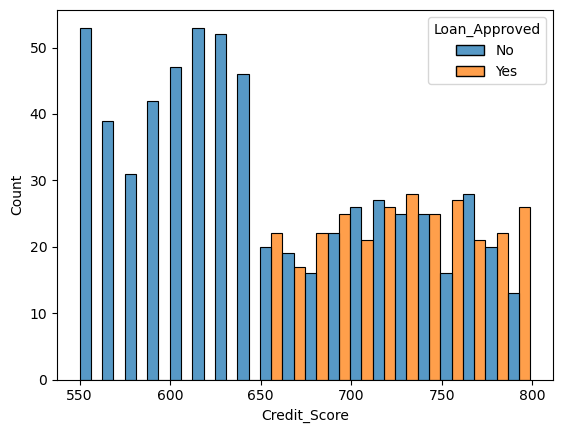
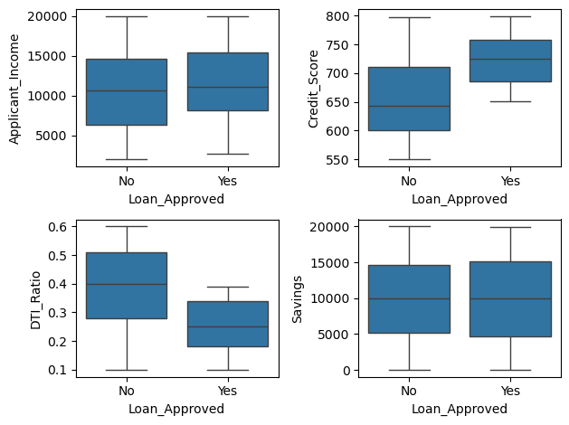
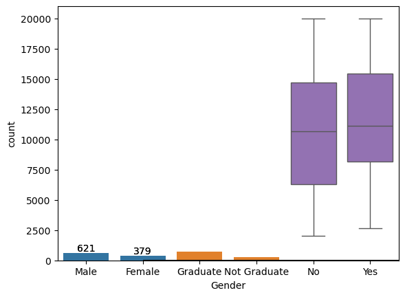
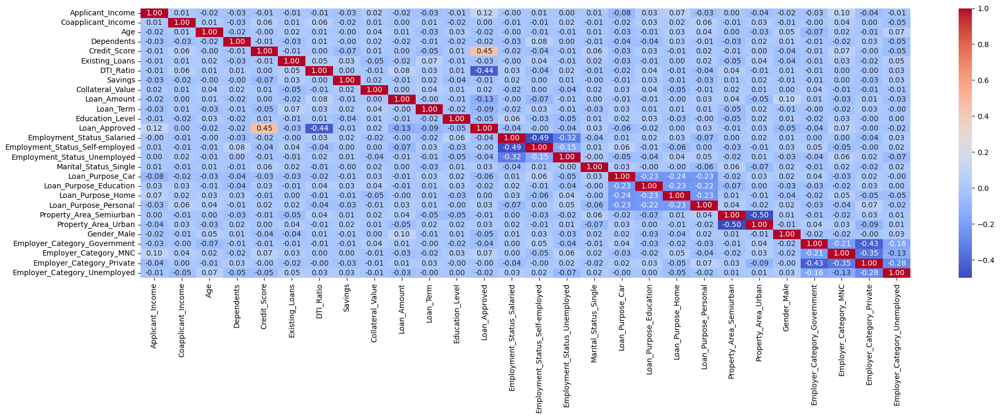

# Loan Approval Predictor

Predicting loan approvals using Machine Learning with a complete end-to-end pipeline covering data preprocessing, exploratory data analysis, model training, and evaluation.

---

## Problem Statement

Banks and financial institutions process thousands of loan applications daily. Manually reviewing each application is time-consuming and prone to inconsistency.

The goal of this project is to predict whether a loan application will be approved based on applicant information such as income, credit score, employment status, and more.

---

## Dataset

**File:** `loan_applicants.csv`

**Target Variable**

- `Y` → Loan Approved
- `N` → Loan Not Approved

### Key Features

| Feature | Description |
|---|---|
| `Applicant_Income` | Monthly income of the applicant |
| `Coapplicant_Income` | Monthly income of the co-applicant |
| `Credit_Score` | Applicant's credit score |
| `DTI_Ratio` | Debt-to-income ratio |
| `Savings` | Applicant's savings amount |
| `Employment_Status` | Type of employment |
| `Education_Level` | Highest education level attained |
| `Marital_Status` | Marital status of the applicant |
| `Loan_Purpose` | Purpose of the loan |
| `Property_Area` | Area type (Urban / Semi-Urban / Rural) |
| `Gender` | Gender of the applicant |
| `Employer_Category` | Category of the applicant's employer |



---

## Tech Stack

- Python
- NumPy
- Pandas
- Matplotlib
- Seaborn
- Scikit-Learn
- XGBoost
- Joblib
- Jupyter Notebook

---

## Project Structure

```text
Loan-Approval-Prediction-System/
│
├── data/
│   └── loan_applicants.csv               # Dataset file
│
├── notebook/
│   └── Loan-Approval-Predictor.ipynb     # Jupyter notebook
│
├── models/                               # Saved trained models
│   ├── logistic_model.pkl
│   ├── NaiveBayes_model.pkl
│   ├── knn_model.pkl
│   └── xgboost_model.pkl
│
├── images/                               # EDA and result snapshots
│   ├── loan_approval_distribution.png
│   ├── feature_correlation_heatmap.png
│   ├── credit_score_vs_loan_approval.png
│   ├── features_vs_loan_approval_boxplots.png
│   └── education_gender_distribution.png
│
├── requirements.txt                      # Python dependencies
├── .gitignore                            # Ignored files
└── README.md                             # Project documentation
```

---

## How to Run

### Clone the Repository

```bash
git clone https://github.com/<your-username>/Loan-Approval-Prediction-System.git
cd Loan-Approval-Prediction-System
```

### Install Dependencies

```bash
pip install -r requirements.txt
```

### Open the Notebook

```bash
jupyter notebook
```

---

## Exploratory Data Analysis

The EDA phase explores patterns in the data before model training.

### Credit Score vs Loan Approval

Higher credit scores are strongly associated with loan approvals.



### Feature Distributions by Loan Outcome

Applicant income, credit score, DTI ratio, and savings all show meaningful differences between approved and rejected applications.



### Education & Gender Distribution



### Feature Correlation Heatmap



---

## Data Preprocessing

- **Missing values** handled using `SimpleImputer` — mean strategy for numerical columns, most frequent strategy for categorical columns
- **Label Encoding** applied to `Education_Level` and `Loan_Approved`
- **One-Hot Encoding** applied to `Employment_Status`, `Marital_Status`, `Loan_Purpose`, `Property_Area`, `Gender`, and `Employer_Category`
- **StandardScaler** used to scale features before model training

---

## Model Performance

Four models were trained and evaluated on the same train/test split (80/20).

| Model | Accuracy | Precision | Recall | F1 Score |
|---|---|---|---|---|
| Logistic Regression | — | — | — | — |
| Naive Bayes | — | — | — | — |
| KNN (k=13) | — | — | — | — |
| XGBoost | 93% | 84.06% | 95.08% | 89.23% |

> **Note:** Fill in Logistic Regression, Naive Bayes, and KNN metrics after running the notebook.

---

## Saved Models

Trained models are stored in the `models/` directory and can be loaded directly without retraining:

```python
import joblib

model = joblib.load("models/xgboost_model.pkl")
predictions = model.predict(X_test_scaled)
```

---

## Key Learnings

- Proper imputation strategy matters — using mean for numerical and most frequent for categorical avoids data leakage
- Fitting the scaler only on training data and transforming test data separately prevents information leakage
- Using `drop="first"` in OneHotEncoder avoids the dummy variable trap
- Comparing multiple models reveals trade-offs between accuracy, precision, and recall
- XGBoost with hyperparameter tuning (`n_estimators`, `max_depth`, `learning_rate`) can outperform simpler models on structured tabular data

---

## Conclusion

This project demonstrates a complete machine learning pipeline for a binary classification problem. Starting from raw data, the notebook walks through cleaning, visualization, feature engineering, model training, and evaluation — producing four saved models ready for deployment or further tuning.
